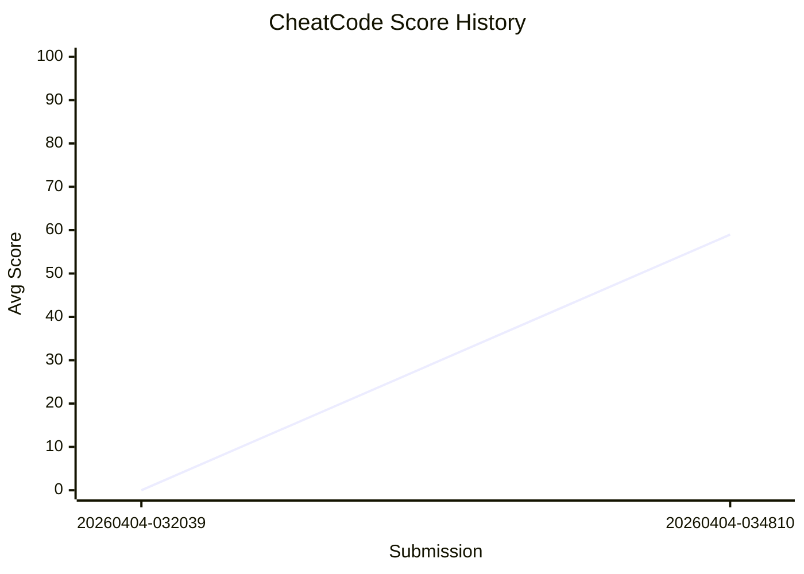

# Cheatcode Benchmark Leaderboard

> 5 configs x 3 trials = 15 trials per policy. Score: average total across all trials (max 100).

**Baseline (CheatCode): 58.98 / 100**

| Rank | Policy | Author | Avg | Min | Max | T1 | T2 | T3 | Trials | Date |
|------|--------|--------|-----|-----|-----|----|----|----|--------|------|
| 1 | AutoCode | [@unknown](https://github.com/unknown) | 63.64 | 33.068283986011146 | 93.93391504782474 | 1.0 | 17.3 | 45.34 | 15/15 | 2026-04-04 |
| 2 | CheatCode | [@weedmo](https://github.com/weedmo) | 58.98 | 24.559954128460088 | 93.29406747263644 | 1.0 | 16.92 | 41.06 | 15/15 | 2026-04-04 |

## Score History

### AutoCode

```mermaid
xychart-beta
    title "AutoCode Score History"
    x-axis "Submission" ["20260404-041523"]
    y-axis "Avg Score" 0 --> 100
    line "AutoCode" [63.64]
```

### CheatCode



## How to Run

```bash
# Run benchmark for your policy
./benchmark/scripts/run_benchmark.sh your_package.ros.YourPolicy

# CheatCode baseline (needs --ground-truth)
./benchmark/scripts/run_benchmark.sh aic_example_policies.ros.CheatCode --ground-truth
```
